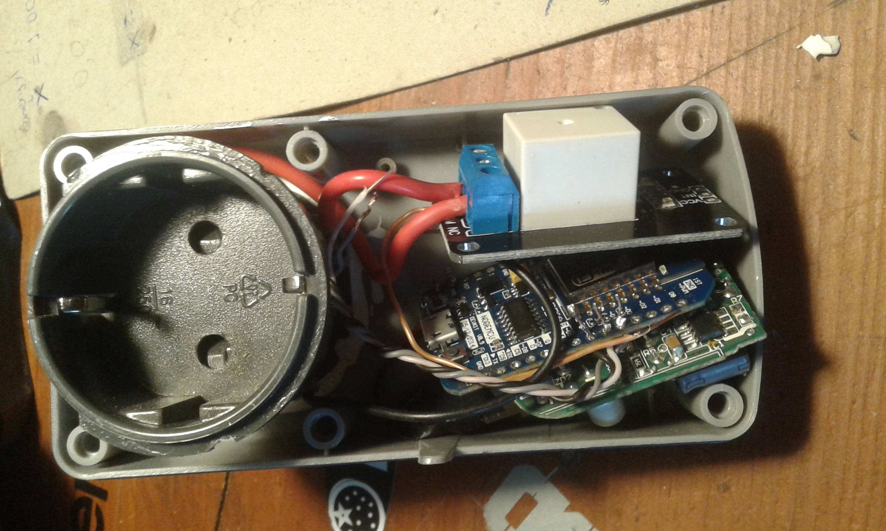

# [nodeMcu WebServer](https://leytpapas.github.io/nodeMcuWebServer/)

A simple web server with a simple switch for home automation using Wifi. The server also accepts json requests for minimum communication and quicker response.

### Software

* Arduino IDE with the appropriate setting to connect with nodemcu board
* ESP8266Wi-Fi library


### Hardware

* NodeMCU ESP8266  Board


* 3V relay


* 5V AC/DC Converter Switch Power Supply Module


* Old box to fit setup for easy use + some rubber to put among the boards for isolation (isn't shown in the pictures). It gives power to AC/DC converter which powers the nodemcu board and the relay controls whether it will also give power to the device plugged in it





* Result: a way to control every device you want just by plugging it to the power using this setup.


Now, go make an army of these but dont forget to note each device's hostname.


### How to use (***Needs update***)

* Fill ssid and password to be broadcasted every time the node can't connect to a network.

```
const char* ssid = "your ssid here";

const char* password = "your password here";
```

Note the IP Address of the webserver when it also serves as 'access point'.

```
IPAddress  apIP(192,168,3,4);
```

* Enter the pin you connected the relay to.

```
int relay = D4;
```

* Upload the code and plug it in

* Connect to the access point(nodemcu) you configured and add the ssid and password of the network you want it to connect to.

* After it's connected you can find it's IP address either using your preffered mapper or by searching your routers allocated addresses.
(an alternative option would be to connect it first at the computer and get its assigned IP using the Serial or even attach a LED screen)

* Go to your brower and hit that IP (make sure you are connected to the same network or have a way of communication with that network). BOOM you are ready to go. 


### Suggestions

  * (***Needs update***)I use [this](https://play.google.com/store/apps/details?id=ch.rmy.android.http_shortcuts) app which sets up widgets on the phone/tablet for everyday use. An example of shorcuts is on the httpRequestShortcuts folder, you can import them and then edit them. Just changing the IP address should be ok, but depending on the way the relay is connected 'on' and 'off' could be reverted with each other. 
  A drawback of this method is that each time the devices get a new IP address you also have to edit the shortcuts at the app. Even though I tried to reach the device using the assigned hostname it failed, but I believe there is something wrong with my router.
  Of course, you can set a static IP for each device so that you don't have to deal with the above problem in every reset. In my case, the devices were reachable but they were missing from the routers tables so I reverted to the dynamic IP.

  * Another work around is to bind nodemcu's mac address to a specific IP from inside the router. With this setting router will allocate this IP for this specific this device so it gets the same IP everytime it's connected.

  * Portforwarding would let you have access to your setup from anywhere in the world. Just make sure you have a static IP address on your home network or have another way of knowing its IP address(etc. dydns or send it to yourself via mail or your favorite messenger everytime it changes)


### Future Work 

- [x] Make static IP work or more prefferable reach devices using hostname.

	Uncomment the following line to make nodemcu board listen to this IP. Hostname is enabled by default.
```
	//#define STATICIP
```

- [x] Set a logic where you can connect via Wifi to the device and change SSID and password(instead of having them 'hardcoded'). Probably I have find a way to trigger a reboot of the device using code.


##### Any suggestions are welcome #####
